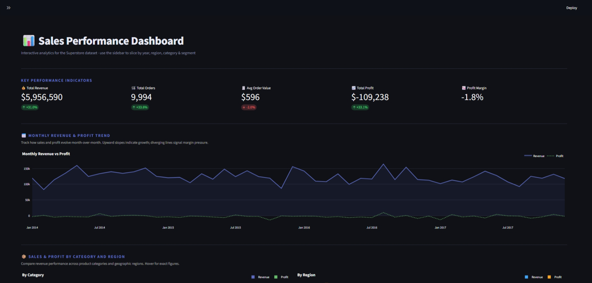
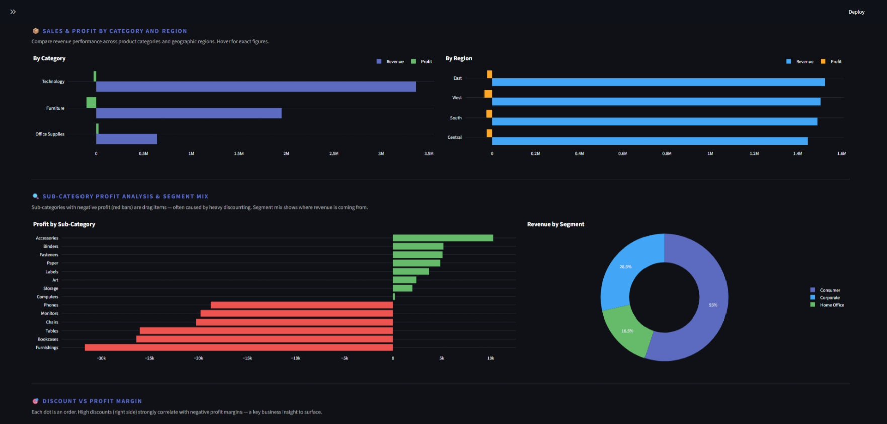

# 📊 Superstore Sales Dashboard


An interactive sales analytics dashboard built with **Streamlit + Plotly + Pandas** using the classic Superstore dataset. Built as a portfolio project to demonstrate end-to-end data analysis and dashboard deployment skills.



---

## 🚀 Run Locally (5 minutes)

### 1. Clone the repo
```bash
git clone https://github.com/Parveez19/Business-Sales-Dashboard
cd superstore-dashboard
```

### 2. Install dependencies
```bash
pip install -r requirements.txt
```

### 3. Generate the dataset
```bash
python generate_superstore.py
```
> **Alternatively**, download the real Superstore dataset from [Kaggle](https://www.kaggle.com/datasets/vivek468/superstore-dataset-final) and save it as `superstore.csv` in the project root.

### 4. Run the app
```bash
streamlit run app.py
```
Open `http://localhost:8501` in your browser.

---

## ☁️ Deploy to Streamlit Cloud (Free, 2 minutes)

1. Push this repo to GitHub (make sure `superstore.csv` is committed)
2. Go to [share.streamlit.io](https://share.streamlit.io)
3. Click **New app** → connect your GitHub repo
4. Set **Main file path** to `app.py`
5. Click **Deploy** — it goes live in ~2 minutes
6. Paste the live URL at the top of this README and on your LinkedIn/resume

---

## 📈 Features

| Section | What it shows |
|---|---|
| **KPI Cards** | Revenue, Orders, AOV, Profit, Margin — with YoY delta |
| **Monthly Trend** | Revenue & Profit over time (line chart) |
| **Category / Region** | Side-by-side grouped bar charts |
| **Sub-Category Profit** | Red = unprofitable sub-categories |
| **Segment Donut** | Revenue split by customer segment |
| **Discount Scatter** | Shows discount → margin erosion pattern |
| **Top 10 Table** | Highlighted dataframe with margin coloring |

All charts update dynamically with the **sidebar filters** (Year · Region · Category · Segment).

---

## 🔑 Key Business Insights

- **West region** generates the highest revenue but carries lower profit margins than East — a discounting problem worth investigating
- Sub-categories **Tables** and **Bookcases** consistently show negative profit margins
- Discounts above **40%** almost always result in negative profit — a clear pricing policy issue
- **Technology** drives the highest revenue per order despite being a smaller volume category

---

## 🛠️ Tech Stack

- **[Streamlit](https://streamlit.io)** — dashboard framework
- **[Plotly](https://plotly.com/python/)** — interactive charts
- **[Pandas](https://pandas.pydata.org/)** — data manipulation
- **[NumPy](https://numpy.org/)** — numerical operations

---

## 📁 Project Structure

```
superstore-dashboard/
├── app.py                  # Main Streamlit application
├── generate_superstore.py  # Script to create the dataset
├── superstore.csv          # Dataset (commit this to GitHub for deployment)
├── requirements.txt        # Python dependencies
├── .streamlit/
│   └── config.toml         # Dark theme config
└── README.md
```